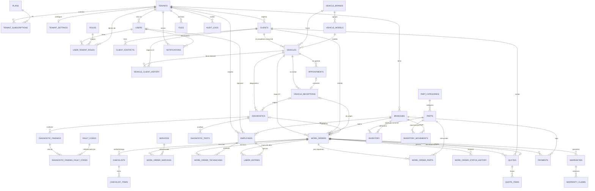

# FASE 4 — DIAGRAMA ERD (Mermaid)

**Notas del diagrama**
- Las líneas `||--o{` indican 1..N; `|o--o|` relación opcional 0..1.
- `WORK_ORDERS ⇄ QUOTES` es una FK bidireccional *opcional* (permite COT→OT y OT→COT sin ciclos reales: ambos lados NULL-ables).
- `FILES`, `AUDIT_LOGS` e `INVENTORY_MOVEMENTS.reference` usan referencias polimórficas (`entity_type + entity_id`) para no acoplar el modelo.
- Todos los nodos con datos de empresa llevan `tenant_id`; el diagrama solo muestra las relaciones de negocio.